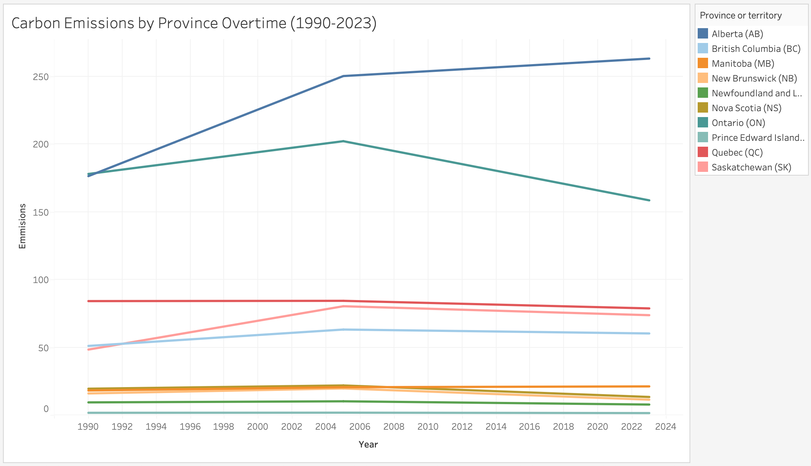

# Coordinating the Energy Transition: A Decision Analysis of Interprovincial Grid Integration in Canada

# Decision Statement 
The Government of Canada must decide whether to prioritize federal investment in interprovincial electricity grid integration or continue focusing on province-by-province clean energy development as the primary strategy for achieving national emissions reduction targets.

# Executive Summary
Canada’s transition to green energy presents a complex policy challenge shaped by geography, constitutional structure, and competing provincial interests. While Canada has made strong national and international climate commitments, progress has been uneven due to discrepancies in green energy capacity and infrastructure across provinces. Historically, Canada’s electricity grid has been designed around prioritizing trade with the United States rather than interprovincial integration. This structure reflects provincial constitutional control over natural resources, but it has also produced fragmented infrastructure and missed opportunities to share clean energy domestically. As a result, limited transmission capacity continues to restrict Canada’s ability to move clean power between provinces, undermining both emissions-reduction goals and economic efficiency.

Recent geopolitical tensions between Canada and the United States have renewed federal interest in expanding interprovincial energy trade, particularly as a means of strengthening energy security and advancing climate objectives. However, this shift has exposed significant political and economic constraints. Provinces remain wary of federal involvement in energy infrastructure, and past attempts at grid integration—such as Nova Scotia’s halted interconnection efforts—highlight the risks of rising energy costs and uneven regional impacts. A rushed or poorly coordinated approach risks harming all stakeholders, but especially the Canadian population, who are already facing sustained cost-of-living pressures. These tensions have produced two competing policy paths: decentralized, province-by-province clean energy development, which offers speed and jurisdictional clarity but risks reinforcing fragmentation; and federally coordinated interprovincial grid integration, which promises long-term efficiency and emissions reductions but faces high upfront costs, long timelines, and political resistance.

This project examines how the federal government should navigate these competing approaches when allocating climate and infrastructure funding. The analysis considers the interests of three key stakeholders: the federal government, which seeks national prosperity while meeting international climate commitments; provincial governments, which prioritize provincial economic outcomes and resource autonomy; and the Canadian population, including First Nations communities, whose economic well-being and rights must be respected in any energy transition. By comparing the long-term economic, environmental, and political implications of interprovincial grid integration versus decentralized provincial development, this project aims to inform a policy decision that balances emissions reduction, affordability, equity, and political feasibility across Canada.

# Casual Loop Diagram

