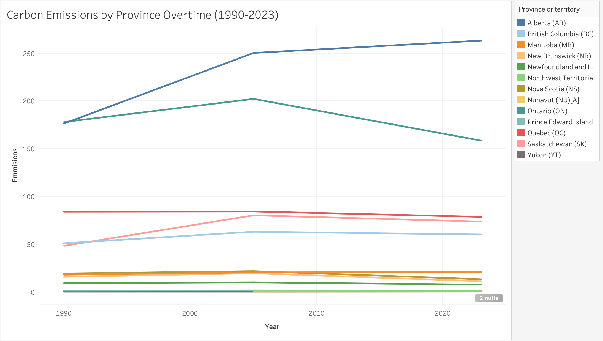
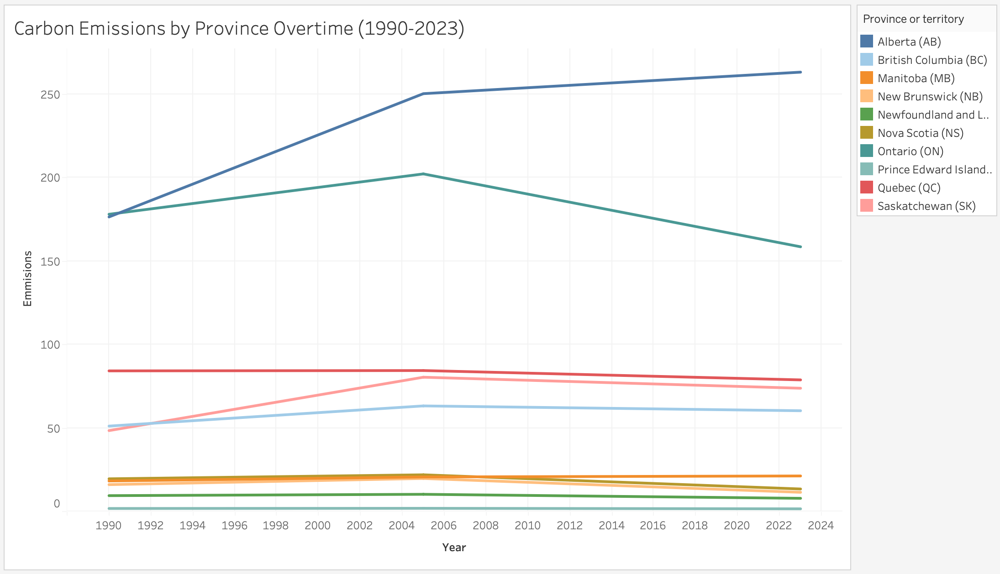
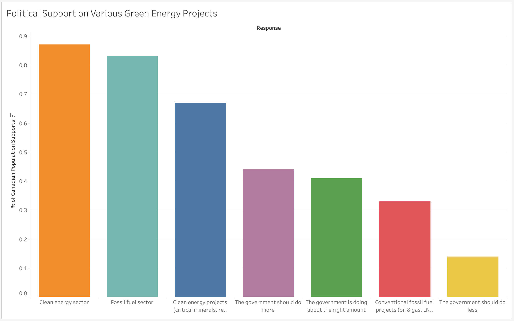
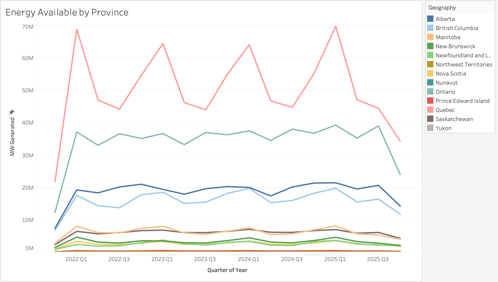
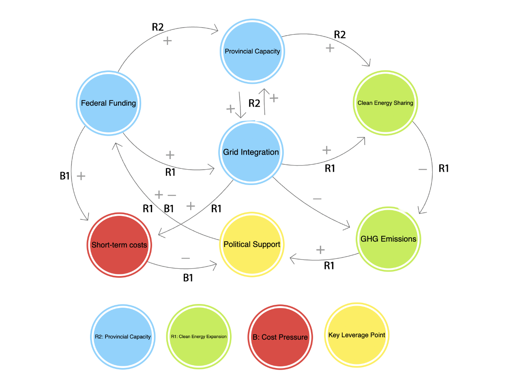

# Coordinating the Energy Transition: A Decision Analysis of Interprovincial Grid Integration in Canada

# Decision Statement 
The Government of Canada must decide whether to prioritize federal investment in interprovincial electricity grid integration or continue focusing on province-by-province clean energy development as the primary strategy for achieving national emissions reduction targets.

# Executive Summary
Canada’s transition to green energy presents a complex policy challenge shaped by geography, constitutional structure, and competing provincial interests. While Canada has made strong national and international climate commitments, progress has been uneven due to discrepancies in green energy capacity and infrastructure across provinces. Historically, Canada’s electricity grid has been designed around prioritizing trade with the United States rather than interprovincial integration. This structure reflects provincial constitutional control over natural resources, but it has also produced fragmented infrastructure and missed opportunities to share clean energy domestically. As a result, limited transmission capacity continues to restrict Canada’s ability to move clean power between provinces, undermining both emissions-reduction goals and economic efficiency.

Recent geopolitical tensions between Canada and the United States have renewed federal interest in expanding interprovincial energy trade, particularly as a means of strengthening energy security and advancing climate objectives. However, this shift has exposed significant political and economic constraints. Provinces remain wary of federal involvement in energy infrastructure, and past attempts at grid integration—such as Nova Scotia’s halted interconnection efforts—highlight the risks of rising energy costs and uneven regional impacts. A rushed or poorly coordinated approach risks harming all stakeholders, but especially the Canadian population, who are already facing sustained cost-of-living pressures. These tensions have produced two competing policy paths: decentralized, province-by-province clean energy development, which offers speed and jurisdictional clarity but risks reinforcing fragmentation; and federally coordinated interprovincial grid integration, which promises long-term efficiency and emissions reductions but faces high upfront costs, long timelines, and political resistance.

This project examines how the federal government should navigate these competing approaches when allocating climate and infrastructure funding. The analysis considers the interests of three key stakeholders: the federal government, which seeks national prosperity while meeting international climate commitments; provincial governments, which prioritize provincial economic outcomes and resource autonomy; and the Canadian population, including First Nations communities, whose economic well-being and rights must be respected in any energy transition. By comparing the long-term economic, environmental, and political implications of interprovincial grid integration versus decentralized provincial development, this project aims to inform a policy decision that balances emissions reduction, affordability, equity, and political feasibility across Canada.

# Table of Contents
## [Background](Background.md)
## [Casual Loop Diagram](#casual-loop-diagram-1)
#### [Breakdown of casual loop diagram](#breakdown-of-casual-loop-diagram-1)
## [Visualizations](#visualizations-1)
### [Provincial energy profiles](#provincial-energy-profiles-fig-1)
### [Carbon emissions by province overtime](#carbon-emissions-by-province-overtime-fig-2)
### [Political support for green energy projects](#political-support-for-green-energy-projects-fig-3)
### [Energy available by province](#energy-available-by-province-fig-4)
## [System Analysis](#system-analysis-1)
### [System archetype identification](#system-archetype-identification-growth-and-underinvestment)
### [Scenario narratives](#scenario-narratives-1)
#### [Status quo](#1-status-quo-1)
#### [Intervention A](#2-intervention-a-federal-grid-integration-strategy-1)
#### [Intervention B](#3-intervention-b-decentralized-provincial-investment-strategy-1)
#### [Levarage point analysis](#levarage-point-analysis-1)
## [Recommendation](#recommendation-1)
### [The core argument](#the-core-argument-1)
### [Why the other options fail](#why-the-other-options-fail-1)
### [The critical condition](#the-critical-condition-1)
### [The public mandate](#the-public-mandate-1)
## [Data Sources](Data)

# Visualizations

## Provincial Energy Profiles (fig. 1)

This visualization shows the energy production mix of Canadian provinces, with each pie chart representing the relative contribution of different fuel types to a province’s total energy production. By mapping these energy profiles geographically, the visualization highlights how regional resources and economic structures shape provincial energy systems. For example, provinces in Western Canada display stronger shares of fossil fuels and wind, while central and eastern provinces show larger contributions from hydro and nuclear energy. This visualization supports the project by illustrating the regional diversity of Canada’s energy landscape, making it easier to compare how provinces rely on different energy sources and identify broader patterns in the country’s overall energy production.

## Carbon Emissions by Province Overtime (fig. 2)

This line graph provides a long-term historical perspective on carbon emissions across Canada, emphasizing the stark contrast in environmental impact between provinces. Alberta stands out with the highest and most consistently rising emission levels, a reflection of its carbon-intensive industrial and energy sectors. Conversely, Ontario shows a significant downward trend starting in the mid-2000s—widely attributed to its phase-out of coal-fired power plants—while provinces like Quebec maintain relatively stable, lower emissions due to their reliance on renewables. By visualizing these trajectories, the chart highlights the disparate challenges each province faces in meeting national climate targets and identifies where the most aggressive decarbonization efforts are needed. Overall, it demonstrates which provinces are willing to change their current energy habits to meet global standards.

## Political Support for Green Energy Projects (fig. 3)

This bar chart visualizes Canadian public opinion on green energy, drawn from Abacus Data polling conducted on behalf of Clean Energy Canada. The results show strong support across most categories, with Canadians viewing both the clean energy sector (87%) and fossil fuel sector (83%) as economically important. When asked to choose between the two, however, a clear preference emerges — 67% of Canadians favour clean energy projects over conventional fossil fuel development (33%).
On the question of federal climate action, the data shows that the vast majority of Canadians want the government to maintain or increase its efforts, with 44% saying the government should do more and 41% saying it is doing about the right amount. Only 14% believe the government should do less, making it the smallest bar in the chart by a considerable margin.

## Energy Available by Province (fig. 4)

This visualization illustrates the total "Energy Available" or generated across Canadian provinces on a quarterly basis, revealing strong seasonal patterns in production. Quebec clearly dominates the landscape, exhibiting sharp peaks in the first quarter of each year, which aligns with the high demand for heating and the resulting ramp-up of its massive hydroelectric capacity. Ontario follows as the second-largest producer with a more stable output, likely due to its steady nuclear baseload. By showing the total MW generated, this chart underscores the uneven distribution of energy infrastructure in Canada, where a few provinces provide the vast majority of the nation's power, and highlights the cyclical nature of energy availability within the Canadian grid.

# Casual Loop Diagram

## Breakdown of casual loop diagram
This causal loop diagram (CLD) illustrates how federal climate and infrastructure investment interact with political constraints and system outcomes in Canada’s green energy transition. 

The CLD consists of two reinforcing loops and one balancing loop. The two reinforcing loops are clean energy expansion (R1) and provincial capacity (R2). R1 demonstrates how an increase in federal funding for these projects—e.g. grid integration—leads to decreased greenhouse gas emissions, and with the decrease in greenhouse gas emissions, increased political support for the project. R2 operates similarly to R1, as increased federal funding leads to increased provincial capacity and grid integration. As grids become increasingly integrated, each province has more capacity. The structure of this system suggests a pattern of slow initial growth followed by accelerating momentum. Early on, B1 dominates — short-term costs accumulate faster than emissions reductions are visible, dampening political support before R1 can gain traction. However, if federal funding is sustained long enough for grid integration to mature, R1 begins to overpower B1: emissions fall, public confidence grows, and political support reinforces further investment. The critical risk is that the system stalls in the early phase, which is precisely what nearly happened with the Atlantic Loop. The balancing loop in this CLD is the cost pressures that come with these projects. The key relationship in this loop is how costs affect political support. Obviously, government projects like this require large amounts of capital, with most of it coming from taxpayer money. Additionally, projects like interconnected grids can potentially lead to higher costs of living — as seen with energy prices increasing if Nova Scotia went forward with the Atlantic Loop. If political support falters, it is unlikely that the federal government will be able to continue with these projects.

The key leverage point in this CLD is political support, as it decides whether or not any level of government includes something on their political agenda. Political support is a variable in both the reinforcing loops and the balancing loop, emphasizing its importance to the CLD. It would be difficult for a government to intervene directly in this variable, especially in a democratic country like Canada, where you cannot get away with telling the people what is best for them. As a result, the only way to intervene in this variable is by being successful in R1, as success in R1 leads to increased political support and increased funding.

For a federal decision-maker weighing whether to continue funding interprovincial grid projects, this CLD suggests the choice is not simply about infrastructure — it is about whether to sustain investment through the politically vulnerable early phase long enough for R1 to self-reinforce. Cutting funding prematurely locks the system into B1's logic, where costs dominate and support erodes. Staying the course, particularly by communicating early emissions wins to the public, is the structural intervention most likely to shift the system toward the R1 growth trajectory.

# System Analysis

## System Archetype Identification: Growth and Underinvestment
For this decision context, the dominant system arhcetype is growth and underinvestment. This is due to Canada's green energy expansion having clear potential for expansion. However, that expansion is constrained by insufficent and delayed investment into interpovincial grid connection. While there are additonal factors that are causing this underinvesment it all boils down to a lack of capital being put in place to start and complete these projects. 

In the CLD model above, a clear reinforcing loop is outlined:
    Federal funding->Grid integration->Clean energy sharing->Lower GHG emissions->Political support->Federal funding

However, the growth outlined in the reinforcing loop is balanced by:
    Federeal funding->Increased costs->Reduced political support->Reduced federal funding

As large-scale investments into infrastructure raise short term electricy prices political support for these projects will dwindle. This is really the crux of the whole decision making context. For the people—who support the political parties—this truly is an investment, they won't see the returns until much later. This idea generally applies to all green policy as the benfits of these policies is not immediate. The growth is there, it just needs the proper funding.

The key indicator in this loop is the relation between political support and federal funding. The political support variable can be broken down further into any number of other variables but in this context it can be broken down into public cost and economic impact or realized gains. Energy available by province and energy exported to the US best exemplify the latter. The provinces that will most likley produce the most political support for a project like this are going to be leading in these categories. This is due to them already having required infracture in place, producing excess energy that they can share to other provinces, and economic benefits from renewable energy. For example, provinces like Quebec and Ontario who have robust green energy infrastructure and produce and export large amounts of energy will be in favour of this policy as there is little downside. However a province like Alberta which relies heavily on petroleum and natural gas and doesn't match the production or exports of the provinces above will be opposed.

## Scenario Narratives

### 1. Status Quo

Over the next 5–10 years, Canada continues to pursue a decentralized, province-by-province green energy strategy. Provinces prefer to invest in their own generation capacity, prioritizing jurisdictional autonomy over interprovincial coordination. While this approach allows for incremental progress, it reinforces fragmentation within the Canadian energy system.

The reinforcing loop (R) remains weak, as limited grid integration restricts clean energy sharing. Provinces with surplus clean energy—such as Quebec and Ontario—continue exporting electricity to the United States rather than their fellow provinces. Occuring concurrently, the fossil fuel–dependent provinces—such as Alberta and Saskatchewan—face higher costs transitioning independently, slowing emissions reductions.

The balancing loop (B) remains active but less visible. Costs are unevenly distributed across provinces as those that lack green energy infrastructure begin to lage behind those that do, increasing the desparity between the "have and have not" provinces. This strategy is pursude rather than concentrated costs in large federal projects to reduce immediate political backlash. However, this comes at the expense of long-term efficiency.

Emissions decline modestly, but unevenly. Based on historical trends, provinces like Ontario may continue gradual reductions, while Alberta and Saskatchewan remain high emitters. National emissions targets are likely missed or delayed.

By year 10, Canada maintains a politically stable but inefficient system and potentially unstable system as those that can do and those that cannot remain stuck in their ways. Clean energy capacity exists, but systemic barriers prevent optimization. The country remains reliant on external energy markets and fails to fully leverage its domestic advantages.

### 2. Intervention A: Federal Grid Integration Strategy

Under this scenario, the federal government prioritizes large-scale investment in interprovincial grid infrastructure. Federal funding increases significantly, directly strengthening the reinforcing loop (R).

In the short term, the balancing loop (B) intensifies. Infrastructure development raises costs, increasing electricity prices and cost-of-living pressures for the public. This leads to a temporary decline in political support, particularly in provinces skeptical of federal involvement—e.g. Alberta.

However, as projects are completed—typically within 5–10 years—grid integration improves, enabling large-scale clean energy sharing. Provinces with surplus hydroelectric power begin supplying fossil fuel–dependent region—example, Manitoba supplying Saskatchewan—educing GHG emissions.

As emissions decline and system efficiency improves, political support rebounds, reactivating the reinforcing loop. Economic benefits—including lower long-term energy costs and increased energy security—further strengthen support.

Quantitatively, emissions reductions could accelerate beyond current trajectories, particularly in high-emitting provinces. Energy price volatility may decrease due to diversified supply.

The key uncertainty is political durability—whether governments can maintain support long enough to fully realize long-term benefits.

### 3. Intervention B: Decentralized Provincial Investment Strategy

In this scenario, the federal government shifts funding toward supporting province-specific clean energy projects, avoiding large-scale grid integration and accusations of federal interferance in provincial jursidiction.

This reduces the strength of the balancing loop (B), as costs are smaller and more localized, minimizing immediate political backlash. Political support remains relatively stable but also remains regionalized.

However, the reinforcing loop (R) is significantly weakened. Without improved grid integration, clean energy sharing remains limited, happening on a smaller scale and by select provinces. Provinces must rely on their own resources, leading to duplicated infrastructure and inefficiencies.

Over time, wealthier or resource-rich provinces advance more quickly, while others lag behind. This risks reinforcing the “have and have nots” dynamic that currently occurs between the provinces, where already-advantaged regions continue to benefit disproportionately.

Emissions reductions occur, but at a slower and more uneven rate. High-emitting provinces face higher transition costs without access to imported clean energy supplementing the process.

By year 10, Canada achieves moderate emissions reductions but misses opportunities for nation-wide optimization. The energy system remains fragmented, and long-term costs are higher than in an integrated model.

The main uncertainty is whether technological improvements or provincial cooperation could offset the lack of integration.

## Leverage Point Analysis
The most impactful leverage point in this system is political support. This is due to it directly influencing the level and consistency of federal funding, which drives the entire clean energy transition. Political supports sits at the center of both the balancing and reinforcing loops: the variable strengthens the reinforcing loop by enabling continued investment into grid integration, while also negativley affected by rising short-term costs in the balancing loop. This makes the variable a high impact intervention point, as even small changes in support can have cascading effects across the system. Through the implementation of policies that reduce the immediate cost burden the government can weaken the balancing loop and sustain funding for the long-term benefits of integration. However, this approach is not without risk. Public resistance to rising costs, regional inequalities, and provincial opposition to federal involvement could all undermine public support. Despite these challenges, targeting political support offers the most efficient way to shift the system, as it addresses the root constraint preventing long-term growth rather than just its symptoms.

# Recommendation
## The core argument
The energy avilable to Quebec and Ontario — as seen in fig. 3 — makes the case for provincial grid integration clear. Quebec and Ontario combine for approximatley 235 million MW of energy capacity, yet this surplus is consitently sent south of the border to the US rather than moving east-west between the provinces. The issue is not that provinces lack the ability to generate enough energy, it is the lack of distribution infrastrcuture that is the problem. In it's current decentralized model, the Canadian federation will not be able to adress this issue. Only coordinated federal infrastructure investment can build the connective tissue needed to redirect that surplus domestically, and the Growth and Underinvestment archetype explains precisely why this gap has persisted: the returns are real, but they require a level of upfront capital commitment that province-by-province development will never achieve.

## Why the other options fail
The Status Quo and Intervention B both share the same fundamental weakness, they leave the reinforcing loop too weak to overcome the balancing loop. Without a viable option to export between provinces, Quebec and Ontario will continue exporting their surplus energy southward, which the export data confirms is already the entrenched default behaviour. Meanwhile, fossil fuel-dependent provinces like Alberta and Saskatchewan face higher independent transition costs without access to imported clean energy to supplement the process, despite there being options to offset this issue with imported clean energy from British Columbia and Manitoba. Rather than closing the gap between Canada's energy haves and have-nots, both alternatives allow it to widen over time, locking the country into a fragmented and inefficient system that falls short of its national emissions commitments.

## The Critical Condition
The recommendation for Intervention A is contingent on the federal government's ability to survive the early B1-dominant phase, where infrastructure costs are rising but the environmental benefits are not yet visible to the public. This is historically where any large-scale projects loses momentum and political support collapses, but is especially crucial for green energy projects. The implementation strategy is therefore just as important as the decision itself. The federal government should sequence investment deliberately — beginning with provinces already positioned for cooperation, such as Quebec, Ontario, and Manitoba. This allows the federal government to generate early, visible wins that sustain public confidence before expanding into more resistant regions like Alberta and Saskatchewan. Each completed project should be treated as a communication opportunity, not just an infrastructure milestone.

## The Public Mandate
The Abacus Data polling provides the federal government with meaningful political cover to absorb the short-term costs that Intervention A requires. With 85% of Canadians wanting climate action maintained or increased, and 67% favouring clean energy development over conventional fossil fuel projects, the public appetite for this transition is broader than the political debate often suggests. Crucially, this support holds even in traditionally resistant regions — 72% of Albertans and 70% of Conservative voters support maintaining or increasing federal climate action. However, the same polling shows that Canadian's are somewhat restitent to the federal government's involvment with the environment with only 44% believing that they should be doing more. While it is easy to mantain political support with majority of Canadians supporting climate action, the government must tread carefully as a wrong move is likley to be scrutinized. Additionally, the political risk of rising energy costs is not eliminated, but it does suggest that a government which communicates early progress effectively has a more durable mandate than the current political narrative implies.